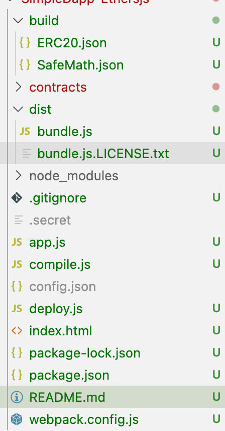
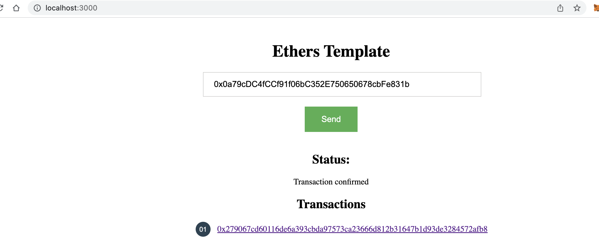

[Ethers.js文档](https://docs.ethers.io/v5/api/contract/contract/#Contract--methods)

## 用Ethers.js构建一个简单的DApp


> 如果你已经在以太坊上开发过DApp，那你在前端JavaScript中可能用过 web3.js。Ethers.js可算是一个轻量级的web3.js，本文将介绍如何使用Ether.js构建一个简单的DApp。

与Web3.js相比，Ethers.js有很多优点，如Ethers.js提供的状态和密钥管理就非常的好用。

Web3的设计场景是DApp应该连接到一个本地节点， 由这个节点负责保存密钥、签名交易并与以太坊区块链交互。现实并不是这样的，绝大多数用户不会在本地运行一个geth节点。Metamask在浏览器应用中有效地模拟了这种节点环境，因此绝大多数web3应用需要使用Metamask 来保存密钥、签名交易并完成与以太坊的交互。

Ethers.js采取了不同的设计思路，它提供给开发者更大的灵活性。Ethers.js 将“节点”拆分为两个不同的角色：

- 钱包：负责密钥保存和交易签名
- 提供器：负责以太坊网络的匿名连接、状态检查和交易发送

### 编译、部署智能合约
本文中我们要与一个ERC20智能合约交互，需要在机器里先安装 nodejs和npm。

创建项目文件夹

首先创建一个文件夹ethers-template，然后在这个文件夹里再创建另一个 contracts文件夹：
```
~$ mkdir -p ethers-template/contracts

```
初始化npm配置

然后进入ethers-template目录初始化npm配置：
```
~$ cd ethers-template
~/ethers-template$ npm init -y
```

创建项目配置文件
接下来创建一个config.json文件保存你的项目配置：
```
{
  "private_key": "24C4FE6063E62710EAD956611B71825B778B041B18ED53118CE5DA5F02E494BA",
  "network": "kovan",
  "ERC20": "0x0DEd9F7D82a24099F09AF7831CaB61B31Df10487",
  "name": "Kanchan Coin",
  "symbol": "SNK",
  "total_supply": "1000000000000000000000000",
  "decimals": 18
}
```
说明如下：


private_key：账户私钥，将使用这个私钥对应的账户在指定网络上部署智能合约。
network：要接入的以太坊网络，ethers.js支持以下网络：
```
homestead：主网
rinkeby
ropsten
kovan
goerli
```
ERC20：声明要交互的已部署合约，可选
name/symbol/decimals：ERC20合约的参数

### 安装ethers.js
现在可以安装ethers.js了：
```
~/ethers-template$ npm install --save ethers
```

### 安装编译合约需要的npm包

为了编译合约，我们还需要安装solc和fs-extra：

```
~/ethers-template$ npm install fs-extra@8.1.0 solc@0.5.11 --save
```

创建ERC20合约代码

在contracts目录下创建文件erc20.sol：

```
~/ethers-template$ touch contracts/erc20.sol

```
并按如下修改：

```
pragma solidity ^0.5.0;

contract ERC20 {
    
    using SafeMath for uint256;
    event Approval(address indexed tokenOwner, address indexed spender, uint tokens);
    event Transfer(address indexed from, address indexed to, uint tokens);
    mapping(address => uint256) balances;
    mapping(address => mapping (address => uint256)) allowed;
    string public symbol;
    uint8 public decimals;
    string public  name;
    uint256 private _totalSupply;

    constructor(uint8 _decimals, string memory _symbol, string memory _name, uint256 _total_supply) public{
        decimals = _decimals;
        symbol = _symbol;
        name = _name;
        _totalSupply = _total_supply;
        balances[msg.sender] = _totalSupply;
    }

    function totalSupply() public view returns (uint256) {
        return _totalSupply;
    }    

    function balanceOf(address tokenOwner) public view returns (uint) {
        return balances[tokenOwner];
    }

    function transfer(address receiver, uint numTokens) public returns (bool) {
        require(numTokens <= balances[msg.sender]);
        balances[msg.sender] = balances[msg.sender].sub(numTokens);
        balances[receiver] = balances[receiver].add(numTokens);
        emit Transfer(msg.sender, receiver, numTokens);
        return true;
    }

    function approve(address delegate, uint numTokens) public returns (bool) {
        allowed[msg.sender][delegate] = numTokens;
        emit Approval(msg.sender, delegate, numTokens);
        return true;
    }

    function allowance(address owner, address delegate) public view returns (uint) {
        return allowed[owner][delegate];
    }

    function transferFrom(address owner, address buyer, uint numTokens) public returns (bool) {
        require(numTokens <= balances[owner]);    
        require(numTokens <= allowed[owner][msg.sender]);
    
        balances[owner] = balances[owner].sub(numTokens);
        allowed[owner][msg.sender] = allowed[owner][msg.sender].sub(numTokens);
        balances[buyer] = balances[buyer].add(numTokens);
        emit Transfer(owner, buyer, numTokens);
        return true;
    }
}

library SafeMath { 
    function sub(uint256 a, uint256 b) internal pure returns (uint256) {
      assert(b <= a);
      return a - b;
    }
    
    function add(uint256 a, uint256 b) internal pure returns (uint256) {
      uint256 c = a + b;
      assert(c >= a);
      return c;
    }
}

```
### 编写合约编译脚本

下面的代码使用solc编译合约文件，将其保存为compile.js：

```
const path = require('path');
const fs = require('fs-extra');
const solc = require('solc');
const config = require('./config.json');

const sourceFolderPath = path.resolve(__dirname, 'contracts');
const buildFolderPath = path.resolve(__dirname, 'build');

const getContractSource = contractFileName => {
  const contractPath = path.resolve(__dirname, 'contracts', contractFileName);
  const source = fs.readFileSync(contractPath, 'utf8');
  return source;
};

let sources = {};

fs.readdirSync(sourceFolderPath).forEach(contractFileName => {
  sources = {
    ...sources,
    [contractFileName]: {
      content: getContractSource(contractFileName)
    }
  }
});

const input = {
    language: 'Solidity',
    sources,
    settings: {
        outputSelection: {
            '*': {
                '*': [ '*' ]
            }
        }
    }
}

console.log('\nCompiling contracts...');
const output = JSON.parse(solc.compile(JSON.stringify(input)));
console.log('Done');

let shouldBuild = true;

if (output.errors) {
  console.error(output.errors);
  // throw '\nError in compilation please check the contract\n';
  for(error of output.errors) {
    if(error.severity === 'error') {
      shouldBuild = false;
      throw 'Error found';
      break;
    }
  }
}

if(shouldBuild) {
  console.log('\nBuilding please wait...');

  fs.removeSync(buildFolderPath);
  fs.ensureDirSync(buildFolderPath);

  for (let contractFile in output.contracts) {
    for(let key in output.contracts[contractFile]) {
      fs.outputJsonSync(
        path.resolve(buildFolderPath, `${key}.json`),
        {
          abi: output.contracts[contractFile][key]["abi"],
          bytecode: output.contracts[contractFile][key]["evm"]["bytecode"]["object"]
        },
        {
          spaces:2,
          EOL: "\n" 
        }
      );
    }
  }
  console.log('Build finished successfully!\n');
} else {
  console.log('\nBuild failed\n');
}

```

上面的代码将读入并编译contracts目录中的所有合约文件， 然后将编译得到的abi和字节码保存为json文件。

### 编译合约

现在使用compile.js来编译erc20.sol合约：

```
~/ethers-template$ node compile.js

```

编译结束后，我们得到如下的目录结构；

```
+ethers-template
    +compile.js
    +contracts
        -erc20.sol
    +build
        -ERC.json
        -Context.json
        -IERC20.sjon
        -SafeMath.json
   -package.json

```

### 编写合约部署脚本

创建文件deploy.js：
```
~/ethers-template$ touch deploy.js

```
然后按如下修改：

```
const startTimestamp = Date.now();
const ethers = require('ethers');
const config = require('./config.json');
const fs = require('fs-extra');

const provider = ethers.getDefaultProvider(config["network"]);

const wallet = new ethers.Wallet(config["private_key"], provider);
console.log(`Loaded wallet ${wallet.address}`);

let compiled = require(`./build/${process.argv[2]}.json`);

(async() => {
  console.log(`\nDeploying ${process.argv[2]} in ${config["network"]}...`);
  let contract = new ethers.ContractFactory(
    compiled.abi,
    compiled.bytecode,
    wallet
  );

  let instance =  await contract.deploy(config["decimals"], config["symbol"], config["name"], config["total_supply"]);
  console.log(`deployed at ${instance.address}`)
  config[`${process.argv[2]}`] = instance.address
  console.log("Waiting for the contract to get mined...")
  await instance.deployed()
  console.log("Contract deployed")
  fs.outputJsonSync(
    'config.json',
    config,
    {
      spaces:2,
      EOL: "\n" 
    }
  );

})();
```

- 注意：

  - 上面代码中的默认网络是kovan测试网
  - 在这个测试网中，你的账号需要一些以太币来支付部署交易的手续费
  - 将使用config.json中的private_key来部署合约


### 部署合约

运行deploy.js脚本时，需要在命令行传入要部署的合约名称ERC20：

```
~/ethers-template$ node deploy.js ERC20

```
输出结果：
```

Loaded wallet 0xC8e1F3B9a0CdFceF9fFd2343B943989A22517b26
Deploying ERC20 in kovan...
deployed at 0x77Bb3546f5ee356E4026BaA96b7DDf22141bd77B
Waiting for the contract to get mined...
Contract deployed
```
在与合约交互时需要合约部署地址，上面的代码会自动将合约部署 地址保存到config.json文件中。


与智能合约交互
在本文中，我们使用ES6来编写合约交互代码，然后使用webpack 和babel将ES6代码转换为ES5代码。

### 安装ES6构建工具
首先安装这些依赖项：

```
~/ethers-template$ npm i webpack webpack-cli @babel/core \
                          @babel/plugin-proposal-object-rest-spread \
                          @babel/preset-env babel-loader \
                          babel-polyfill -D


```

### 编写前端脚本
创建一个文件app.js：

```
~/ethers-template$ touch app.js
```
然后按照如下修改：

```
const ethers = require('ethers');
const config = require('./config.json');

// Import the json file from build to get the abi
const erc_json = require('./build/ERC20.json'); //import the json of the contract which you want to interact

// You can use any standard network name
//  - "homestead"
//  - "rinkeby"
//  - "ropsten"
//  - "kovan"
//  - "goerli"
const provider = ethers.getDefaultProvider(config['network']);

// Make a wallet instance using private key and provider
const wallet = new ethers.Wallet(config['private_key'] , provider);

const address = config["ERC20"];
const abi = erc_json.abi;

erc20 = new ethers.Contract( address , abi , wallet );

document.getElementById("send").onsubmit = async function(e) {
    e.preventDefault();
    let address = document.getElementById("address").value;
    document.getElementById("status").innerText = "Waiting for transaction to get published...";
	let tx = await erc20.functions.transfer(address, "1000000000000000000");
    let tx_hash = tx.hash;
	let node = document.createElement("LI");
	let link = document.createElement("A");
	link.target = "_blank";
	link.href = `https://${config["network"]}.etherscan.io/tx/` + tx_hash;
	let textnode = document.createTextNode(tx_hash);
	link.appendChild(textnode);
	node.appendChild(link);
	document.getElementById("transactions").appendChild(node);
    document.getElementById("status").innerText = "Waiting for transaction to be mined...";
    await tx.wait();
    document.getElementById("status").innerText = "Transaction confirmed";
    return false;
};

```

首先需要指定要使用的网络/提供器：

```
const provider = ethers.getDefaultProvider(config['network']);

```
为了与合约交互，需要2个东西：

- 合约部署地址
- 合约ABI接口
  
在上面app.js中，我们从配置文件引入了合约地址，从合约编译结果目录中 引入了合约ABI：

```
//import the json of the contract which you want to interact
const erc_json = require('./build/ERC20.json'); 
const config = require('./config.json');
const address = config["ERC20"];
const abi = erc_json.abi;

```
### 创建钱包实例
为了创建合约实例，我们需要先创建一个钱包实例，这样不管什么时候调用 setter方法，都需要一个私钥来签名交易。在ethers.js中，你只需要 创建钱包，所有的setter方法就会由这个钱包签名。

```
const wallet = new ethers.Wallet(config['private_key'] , provider);

```

你也可以使用keystore和助记词来创建一个钱包。如果你希望用这个钱包与 智能合约交互，你还需要传入提供器。如果你只是想用私钥签名消息，那么 就不需要提供器了。

```
erc20 = new ethers.Contract( address , abi , wallet );

```

上面的代码创建了一个合约实例，然后你就可以像这样调用合约函数：

```
erc20.functions.function_name_in_smart_contract(parameters);

```

备注：在ERC20中定义了一个函数transfer，它的参数是转账地址和代币数量。 下面的代码调用了合约的transfer函数，钱包将签名这个交易，然后发布到指定 的网络中：

```
erc20.functions.transfer(address, "1000000000000000000");

```

注意：无论任何时候你要创建一个交易，钱包里都需要以太币来支付交易手续费。

修改启动脚本

在package.json中添加：

```
"deploy": "node compile.js && node deploy.js ERC20", 
"build": "webpack — mode production',
```


修改后的package.json如下：

```

{
  "name": "ethers-template",
  "version": "1.0.0",
  "description": "",
  "main": "webpack.config.js",
  "scripts": {
    "deploy": "node compile.js && node deploy.js ERC20",
    "build": "webpack --mode production",
    "test": "echo \"Error: no test specified\" && exit 1"
  },
  "keywords": [],
  "author": "",
  "license": "ISC",
  "dependencies": {
    "ethers": "^4.0.37",
    "fs-extra": "^8.1.0",
    "solc": "^0.5.11"
  },
  "devDependencies": {
    "@babel/core": "^7.6.0",
    "@babel/plugin-proposal-object-rest-spread": "^7.5.5",
    "@babel/preset-env": "^7.6.0",
    "babel-loader": "^8.0.6",
    "babel-polyfill": "^6.26.0",
    "webpack": "^4.40.2",
    "webpack-cli": "^3.3.9",
    "webpack-dev-server": "^3.8.1"
  }
}

```
如果你后续修改了智能合约，就需要重新编译和部署。可以用一个命令来完成合约的编译和部署：

```
~/ethers-template$ npm run deploy

```
这个命令会自动修改配置文件和合约构件文件。这样在与合约交互时，你就不需要修改合约地址或者ABI接口了。

如果你修改了app.js，也需要重新构建前端代码：

```
~/ethers-template$ npm run build
```

这会生成新的发布版本：dist/bundle.js。

创建宿主html文件
### 创建一个新的文件index.html：

```
~/ethers-template$ touch index.html

 
```

[index.html源码](Dapp/SimpleDapp-Ethersjs/index.html)

现在你的文件夹看起来就是这样了：



[webpack.config.js](Dapp/SimpleDapp-Ethersjs/webpack.config.js)

其中build文件夹将在运行compile.js之后自动创建，而dist 文件夹是在npm run build执行后自动创建。

用浏览器访问看起来是这样：



