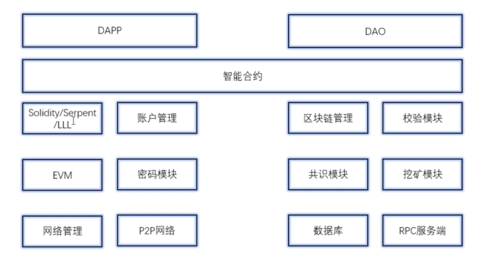
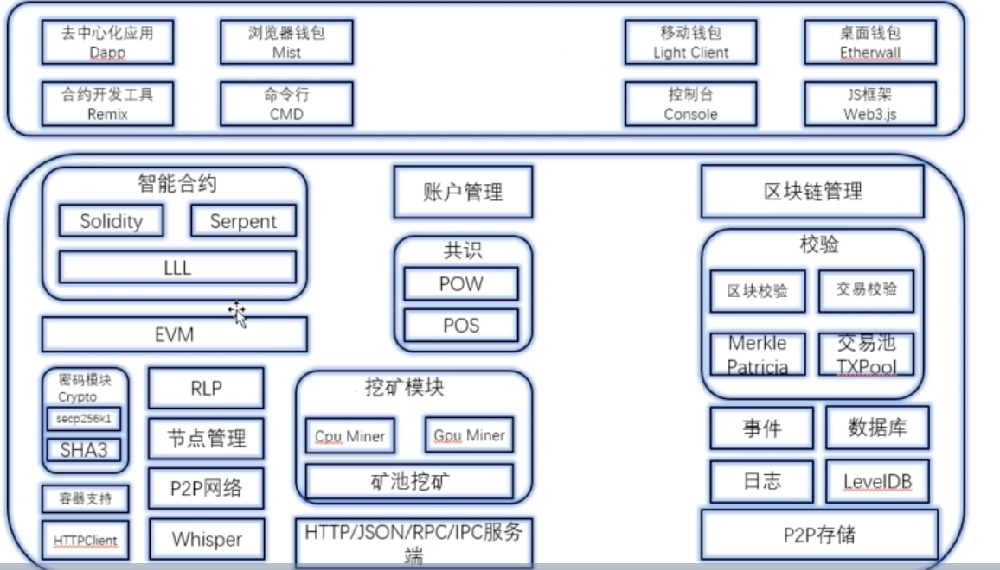

[toc]
## 以太坊逻辑分层 

- 总体架构
  - 
  - 

### 应用层
### 合约层
### 激励层
### 共识层
### 网络层
### 数据库层 


## 分层信息

- 数据层 
  - 存储以太坊区块的所有数据
- 网络层
  - P2P网络，在以太坊中网络层使用kad

- 共识层 
  - 规定通过何种方式实现交易记录的过程

- 激励层
  - 以太坊采用POW实现挖矿奖励机制

- 合约层 
  - 就是开发平台层，通过合约开发任意的Dapp,在以太坊中，主要是EVM和智能合约

- 应用层
  - 以太坊最上层，主要使用truffle和web3.js技术


## 以太坊源码 

- 以太坊的目录结构分析
  - **accounts**  实现以太坊的账号管理
  - bmt       二进制的Merkel树的实现
  - build     编译构建脚本
  - cmd       命令行工具
  - common    公共的工具类
  - consensus 以太坊的共识算法
  - contract  合约
  - core      核心的数据结构与算法 （区块，evm）
  - crypto    核心的加密算法的
  - dashboard 展示
  - eth       以太坊的协议
  - ethClient 以太坊RPC客户端
  - ethdb     以太坊数据库与测试数据库
  - event     以太坊事件
  - ethstats  状态的报告
  - les       以太坊轻量级的协议
  - light     以太坊轻量级客户端，提供索引功能
  - miner     挖矿功能
  - log       日志功能
  - mobile    移动端相关管理
  - node      以太坊中各种类型的节点
  - **p2p**       分布式的传输，主要网络协议
  - rpc       远程过程调用
  - node      各种类型节点
  - rlp       以太坊序列化处理
  - swarm     以太坊swarm网络处理
  - trle      以太坊主要数据结构帕特里夏树的实现
  - whisper   提供whsper节点协议，主要用户DApp之间的通信

## 区块与区块链

- 区块（Block）
  - 所有与账户相关的活动都会以交易的格式存储到block中，每个block中都有一个交易列表
  - 交易执行结构 日志记录
  - 不同的区块连接 ParentHash进行连接
  - atomic是原子操作   core/types/block.go
```
// Block represents an entire block in the Ethereum blockchain.
type Block struct {
	header       *Header
	uncles       []*Header
	transactions Transactions

	// caches
	hash atomic.Value
	size atomic.Value

	// Td is used by package core to store the total difficulty
	// of the chain up to and including the block.
	td *big.Int

	// These fields are used by package eth to track
	// inter-peer block relay.
	ReceivedAt   time.Time
	ReceivedFrom interface{}
}    

// 区块头
type Header struct {

	// 前区块的hash
	ParentHash common.Hash    `json:"parentHash"       gencodec:"required"`
	UncleHash  common.Hash    `json:"sha3Uncles"       gencodec:"required"`
	Coinbase   common.Address `json:"miner"            gencodec:"required"`
	// 默克尔merkle根节点
	Root common.Hash `json:"stateRoot"        gencodec:"required"`
	//
	TxHash      common.Hash `json:"transactionsRoot" gencodec:"required"`
	ReceiptHash common.Hash `json:"receiptsRoot"     gencodec:"required"`
	// 过滤日志，快速判断 日志是否在日志列表里面
	Bloom Bloom `json:"logsBloom"        gencodec:"required"`
	// 挖矿难度
	Difficulty *big.Int `json:"difficulty"       gencodec:"required"`
	Number     *big.Int `json:"number"           gencodec:"required"`
	GasLimit   *big.Int `json:"gasLimit"         gencodec:"required"`
	GasUsed    *big.Int `json:"gasUsed"          gencodec:"required"`

	Time *big.Int `json:"timestamp"        gencodec:"required"`
	// 额外的数据
	Extra []byte `json:"extraData"        gencodec:"required"`
	// 工作量 添加了一个内存难解的，以太坊共识算法  与比特币pow不同
	MixDigest common.Hash `json:"mixHash"          gencodec:"required"`
	// 随机
	Nonce BlockNonce `json:"nonce"            gencodec:"required"`
}

// 交易体 交易信息存储到这里
type Body struct {
	Transactions []*Transaction
	// 防止算力比较强的节点，防止破坏去中心化的原则
	// 抵消区块影响力太大的节点
	Uncles []*Header
}

// 以太坊产生唯一标识符函数
func (b *Block) Hash() common.Hash {
	if hash := b.hash.Load(); hash != nil {
		return hash.(common.Hash)
	}
	v := b.header.Hash()
	b.hash.Store(v)
	return v
}


// 生成区块的hash
func (h *Header) Hash() common.Hash {
	return rlpHash(h)
}


// 区块头的rlp的hash，rlp是一种编码规则
func rlpHash(x interface{}) (h common.Hash) {
	hw := sha3.NewKeccak256()
	rlp.Encode(hw, x)
	hw.Sum(h[:0])
	return h
}


  ```
  
### 新建区块

core/blockchain.go 主要是对区块链状态进行维护，区块的验证插入和查询

```
func NewBlockChain(chainDb ethdb.Database, config *params.ChainConfig, engine consensus.Engine, vmConfig vm.Config) (*BlockChain, error) {
	bodyCache, _ := lru.New(bodyCacheLimit)
	bodyRLPCache, _ := lru.New(bodyCacheLimit)
	blockCache, _ := lru.New(blockCacheLimit)
	futureBlocks, _ := lru.New(maxFutureBlocks)
	badBlocks, _ := lru.New(badBlockLimit)

	bc := &BlockChain{
		config:       config,
		chainDb:      chainDb,
		stateCache:   state.NewDatabase(chainDb),
		quit:         make(chan struct{}),
		bodyCache:    bodyCache,
		bodyRLPCache: bodyRLPCache,
		blockCache:   blockCache,
		futureBlocks: futureBlocks,
		engine:       engine,
		vmConfig:     vmConfig,
		badBlocks:    badBlocks,
	}
	bc.SetValidator(NewBlockValidator(config, bc, engine))
	bc.SetProcessor(NewStateProcessor(config, bc, engine))

	var err error
	bc.hc, err = NewHeaderChain(chainDb, config, engine, bc.getProcInterrupt)
	if err != nil {
		return nil, err
	}
	//获取创世区块
	bc.genesisBlock = bc.GetBlockByNumber(0)
	if bc.genesisBlock == nil {
		return nil, ErrNoGenesis
	}
	//获取最新的状态
	if err := bc.loadLastState(); err != nil {
		return nil, err
	}
	// Check the current state of the block hashes and make sure that we do not have any of the bad blocks in our chain
	for hash := range BadHashes {
		if header := bc.GetHeaderByHash(hash); header != nil {
			// get the canonical block corresponding to the offending header's number
			headerByNumber := bc.GetHeaderByNumber(header.Number.Uint64())
			// make sure the headerByNumber (if present) is in our current canonical chain
			if headerByNumber != nil && headerByNumber.Hash() == header.Hash() {
				log.Error("Found bad hash, rewinding chain", "number", header.Number, "hash", header.ParentHash)
				bc.SetHead(header.Number.Uint64() - 1)
				log.Error("Chain rewind was successful, resuming normal operation")
			}
		}
	}
	// Take ownership of this particular state
	//更新
	go bc.update()
	return bc, nil
}


```