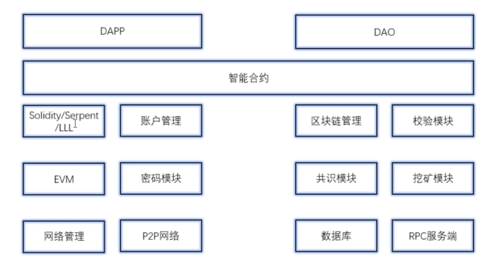
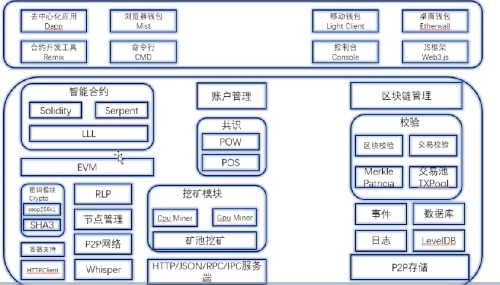

## 以太坊逻辑分层 

- 总体架构
  - 
  - 

### 应用层
### 合约层
### 激励层
### 共识层
### 网络层
### 数据库层 

## 分层信息

- 数据层 
  - 存储以太坊区块的所有数据
- 网络层
  - P2P网络，在以太坊中网络层使用kad

- 共识层 
  - 规定通过何种方式实现交易记录的过程

- 激励层
  - 以太坊采用POW实现挖矿奖励机制

- 合约层 
  - 就是开发平台层，通过合约开发任意的Dapp,在以太坊中，主要是EVM和智能合约

- 应用层
  - 以太坊最上层，主要使用truffle和web3.js技术

