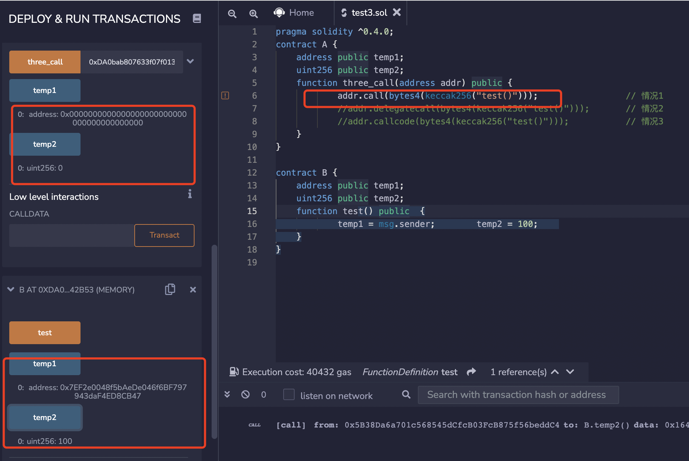
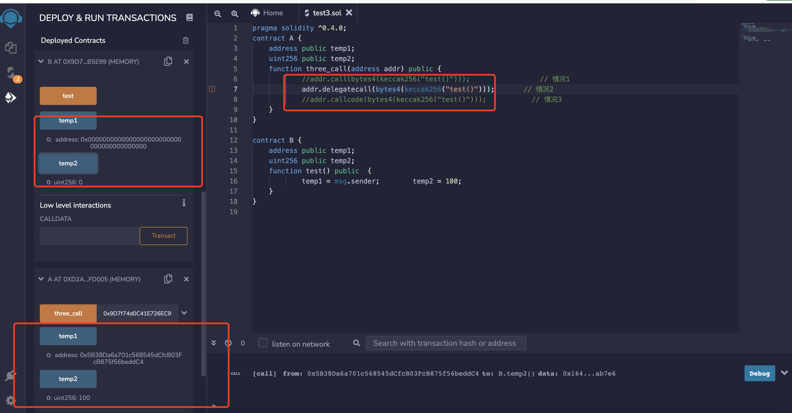
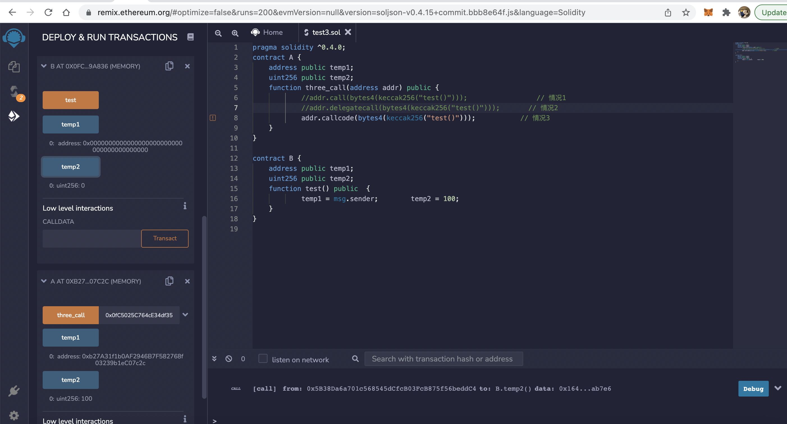

### call   deletecall  && callcode 

对于文章中提到的三种调用方式的异同点

- call: 最常用的调用方式，调用后内置变量 msg 的值会修改为调用者，执行环境为被调用者的运行环境(合约的 storage)。
- delegatecall: 调用后内置变量 msg 的值不会修改为调用者，但执行环境为调用者的运行环境。
- callcode: 调用后内置变量 msg 的值会修改为调用者，但执行环境为调用者的运行环境。
 


```
pragma solidity ^0.4.0; 
contract A {
    address public temp1;
    uint256 public temp2;
    function three_call(address addr) public {
            addr.call(bytes4(keccak256("test()")));                 // 情况1
            //addr.delegatecall(bytes4(keccak256("test()")));       // 情况2
            //addr.callcode(bytes4(keccak256("test()")));           // 情况3   
    }
} 

contract B {
    address public temp1;
    uint256 public temp2;    
    function test() public  {
            temp1 = msg.sender;        temp2 = 100;    
    }
}

```

- 运行过程是：先复制B合约的地址，粘贴到three_call函数的参数栏中，然后点击函数名即可。调用A合约的以太坊账号地址为：0xDA0bab807633f07f013f94DD0E6A4F96F8742B53

- 调用call的结果是 
- 

- 调用deletecall 
- 

- 调用callcode 
-  


> 从上面的运行结果，我们是不是已经看得很明白了。总结一下：
- 情况 1：call
A合约：
temp1 = 0
temp2 = 0

B合约：
temp1 = A合约地址
temp2 = 100

说明：call调用后内置变量 msg 的值会修改为调用者（A合约地址），执行环境为被调用者（B合约）的运行环境(运行环境指合约的 storage)

- 情况 2：delegatecall
A合约：
temp1 = 调用A合约的以太坊账号地址
temp2 = 100

B合约：
temp1 = 0
temp2 = 0

说明：delegatecall调用后内置变量 msg 的值不会修改为调用者（A合约地址），但执行环境为调用者（A合约）的运行环境

- 3情况 3：callcode
A合约：
temp1 = A合约地址
temp2 = 100

B合约：
temp1 = 0
temp2 = 0

说明：callcode调用后内置变量 msg 的值会修改为调用者（A合约地址），但执行环境为调用者（A合约）的运行环境。
 

 
### 合约升级

- 假设我们要计算一个求和公式：numC = numA + numB
我把数据numA、numB、numC作为数据存放在数据合约contract A中，把求和的业务逻辑放在数据合约contract B中。为了演示合约升级，我故意把contract B中的业务逻辑函数calcSum(）中的加法运算故意写成乘法运算，以便后面进行合约升级。代码不是很复杂，代码如下：


- [源码](Solidity/DataTypeSuper/call&deletecall&callcode/demo.sol)


- 我们先部署合约A，再部署合约B。通过合约A的setNumA()函数把NumA设为1，通过合约A的setNumB()函数把NumB设为2，再复制合约A的地址 0x692a70D2e424a56D2C6C27aA97D1a86395877b3A。

- 然后，我们部署合约B，并把合约A的地址粘贴到函数run_sum()的参数栏中，见下图。运行函数run_sum()（直接点击函数名即可）。这时候，我们再点击numC，会看到numC的值为2。显然，这不是我们想要的求和结果。

- 我们把函数calcSum()的 return a * b; 这句注释掉，把 return a + b; 这句的注释去掉，变成下面的代码：

- 先删掉合约B（点击合约B地址栏右边的"x"），重新编译和部署合约B，并把合约A的地址粘贴到函数run_sum()的参数栏中重新运行run_sum()。这时候，我们再点击numC，会看到numC的值为3。合约B升级成功，由原来的乘法运算升级为加法运算。合约A原来的NumA和NumB的内容完美地保留了下来。


 
