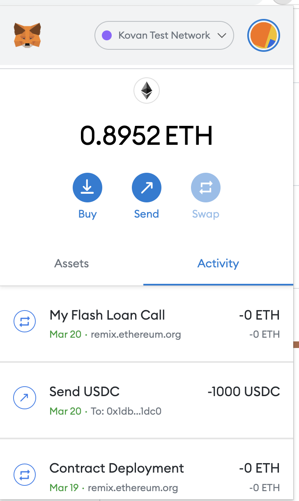

AAVE闪电贷.

address public kovanUsdc = 0xe22da380ee6B445bb8273C81944ADEB6E8450422;
address public kovanAave = 0xB597cd8D3217ea6477232F9217fa70837ff667Af;
address public kovanDai = 0xFf795577d9AC8bD7D90Ee22b6C1703490b6512FD;
address public kovanLink = 0xAD5ce863aE3E4E9394Ab43d4ba0D80f419F61789;

- 我们在创建合约的时候,要将手续费打入我们的合约地址.



> 我们在文件MyV2FlashLoan.sol,执行myFlashLoanCall方法的时候, 会callback执行executeOperation,这里就能写闪电贷的逻辑.
> 闪电贷本质是根据合约方法执行的原子性,不符合条件回滚.


```

 function executeOperation(
        address[] calldata assets,
        uint256[] calldata amounts,
        uint256[] calldata premiums,
        address initiator,
        bytes calldata params
    ) external override returns(bool){
   


/*
Tokens Transferred:
3
From 0xe12afec5aa12cf614678f9bfeeb98ca9bb95b5b0To 0x1dba5d30200ae4c34cbc9d928890b0a7bfc61dc0 For 1,000,000 USD Coin (USDC)

 1,000,000 USDC打到我的合约
From 0x0000000000000000000000000000000000000000To 0x464c71f6c2f760dda6093dcb91c24c39e5d6e18c For 6,243,133,046,688,380.346756 Aave interes... (aUSDC)
From 0x1dba5d30200ae4c34cbc9d928890b0a7bfc61dc0To 0xe12afec5aa12cf614678f9bfeeb98ca9bb95b5b0 For 1,000,900 USD Coin (USDC)
 1,000,900 从我合约payback


*/


       // 还款  必须让操作自己资产    premiums 0.09%利息
        for (uint i=0;i<assets.length;i++){
             uint amountOwing = amounts[i].add(premiums[i]);
             IERC20(assets[i]).approve(address(LENDING_POOL),amountOwing);
        }
        return true;
    }
```