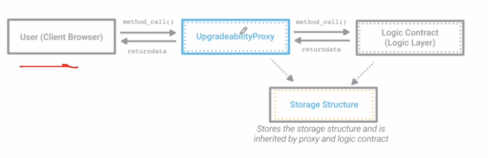

## 区块链的数据不可以修改

- 智能合约的数据可以修改
- 什么是数据不可以篡改
  - 交易在区块里,不会修改
- 智能合约的代码能不能修改?
  - 唯一合约对于一个地址
  - 升级之后 又出现一个地址

## 智能合约"升级"

- 一个单纯的合约是升级还是无法升级的,必须让一个合约调用另外一个合约.
- 智能合约如在调用
  ```
         pragma solidity ^0.6.0;       


        contract A{
            string private name;

            function  setName(string memory _name) public{
                name=_name;
            }
            function getName()  public view returns(string memory){
                    return name;
            }
        }


        contract call_demo{

            A a;

            constructor(address addr) public {
                a =A(addr);
            }

            function  setName(string memory _name) public{
                a.setName(_name);
            }
            function getName()  public view returns(string memory){
                return  a.getName();
            }
            
        }
  ```

- 设计
  - 主-从设计  
    - 主合约地址永恒不变
    - 从合约地址更改或者设置多个
    - 从合约地址可以通过主合约地址获取 
      - 调用一个合约 必须知道地址
      - 一定知道ABI 
     ```
        pragma solidity ^0.6.0;


                interface IA{ 

                    function  setName(string calldata _name) external;
                    function getName()  external view returns(string memory);
                }


                contract A is IA{
                    string private name;

                    function  setName(string memory _name) external override{
                        name=_name;
                    }
                    function getName()  external override view returns(string memory){
                            return name;
                    }
                }


            contract B is IA{
                string private name;

                function  setName(string memory _name) external override{
                    name=_name;
                }
                function getName()  external override view returns(string memory){
                        return name;
                }
            }


            contract call_demo{

                IA a;
                // 不用关心A的实现了
            

                function setIA(address add) public {
                    a= IA(add);
                }

                    function  setName(string memory _name) public{
                        a.setName(_name);
                    }
                    function getName()  public view returns(string memory){
                        return  a.getName();
                    }
                    
                }
      ```
  - 逻辑 + 数据  
  - 代理 + 逻辑 +数据


## 代理模式升级



- 代理模式
  - fallback回调 yul语言
    - 黑客调用fallback()
  - receive接收函数


## fallback() 与receive 

匿名函数 就是fallback()


```
pragma solidity^0.6.1;

contract fallback_demo{
  
   function getBalance() public view returns(uint256 balance){
       balance = address(this).balance;
   }

}


contract send_money{

    function transfer(address payable to,uint256 amount) public payable{

         require(msg.value >=amount ,"value must enough");
         to.transfer(amount);

    }
}
```
  

- 上述代码,不可能转账成功, 因为合约没有合约接受钱的能力.


```
pragma solidity^0.6.1;

contract fallback_demo{
  
   function getBalance() public view returns(uint256 balance){
       balance = address(this).balance;
   }

 // 只要声明了 就可以收钱
//   receive() external payable{

//   }

// fallback与receive 等同
   fallback() external payable {

   }
}


contract send_money{

    function transfer(address payable to,uint256 amount) public payable{

         require(msg.value >=amount ,"value must enough");
         to.transfer(amount);

    }
}
```