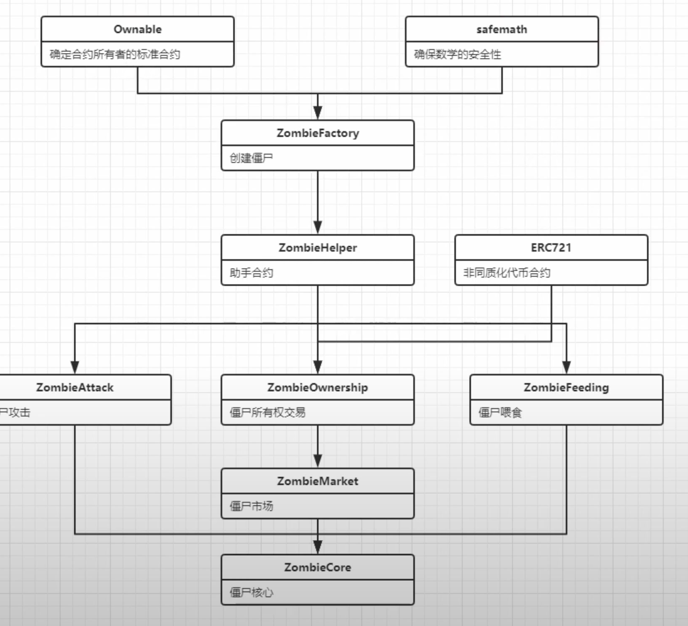

### 僵尸之谜需求
- 基因
  - 每只值尸有一个16位10进利数字作为基因
  - 最后一位数字为特殊标识
  - 僵尸名称为string宁符非
  - 根据名称和随机数创建僵尸基因
- 拥有
  - 每人可以免费领养1只僵尸
  - 拥有超过1只僵尸之后需要购买蛋尸
  - 主动攻击另1只僵尸并且胜利之后可以产生1只僵尸
  - 喂食10次之后会产生1只冊尸
- 对战
  - 主动发起对战一方胜率为70%
  - 胜利计数，失败计数
  - 每天只能主动攻击1次
- 喂食
  - 每天只能喂食1次
  - 喂食计次
  - 喂食每满10次后会产生1只係户
- 交易
  - 可以把自己的僵尸放到市场定价并销售
  - 可以购买市场的僵尸
  - 税金为0.0001ether,可以修改
  - 最低售价0.0001ether,可以修改
  - 购买僵尸的钱除税金后交给原主人
- 升级
  - 主动发起对战并胜利可以升级1次
  - 可以付费升级
  - 升级费为0,001ether,可以修改
- 查询
  - 查问发送者僵尸数量
  - 查询发送者佩尸数组
  - 查询单个僵尸数据
  - 根据地址查询僵尸
  - 查询商店的僵尸
  - 根据ID查询僵尸
- 杂项
  - 名称，标识
  - 空函数
    - 没有调用成功,进行去空函数
  - 查询余额
  - 提款

###  僵尸之谜实现

- 僵尸工厂
  - 变量
  - 构造体
  - 数组
  - 映射
    - 僵尸id=>拥有者
    - 拥有者=>僵尸数量
    - 僵尸id=>喂食次数
  - 事件
    - 新僵尸生成

  - 函数
    - 输入名称创建僵尸
      - 验证发送者僵尸数量为o
      - 根据名称获取随机数dna
      - 将dna最后1位数字修改为o
      - 创建僵尸
    - 随机数函数
      - 根据名称和时间戳创建随机数，和僵尸单位取余数
    - 创建僵尸函数
       - 参数为名称和dna
       - 将僵尸构造体推入僵尸数组，获取返回僵尸id
       - 映射僵尸id=>发送者
       - 映射拥有者=>数量+1
       - 僵尸总数变量+1
       - 触发新僵尸生成事件
    - 购买僵尸函数
      - 验证发送者僵尸数量大于0
      - 验证发送的金额大于僵尸价格
      - 根据名称获取随机数dna
      - 将dna最后1位数字修改为1
      - 创建僵尸 d
    - 设置僵尸价格函数
- 僵尸助手

  - 变量
    - 升级费=0.001ether
  - 修饰符
    - 超过某个等级
    - 只能持有者
   - 函数
     - 设置升级费
     - 升级函数
     - 改名函数
       - 修饰符超过2级
       -  修饰符只有持有者 
     - 获取发送者的所有僵尸
     - 触发冷却函数
       - 冷却时间 =当前时间戳 - 当前时间戳%冷却时间,确保冷却时间为每天0点
     - 验证冷却函数
     - 合体函数
       - 根据僵尸构造体创建我的僵尸变量，赋值为僵尸参数构造体
       - 验证冷却时间
       - 目标dna取dna位数的余数
       - 新dna为两个dna的平均数
       - 新dna末尾1位数为9
       - 根据新dna创建名为noname的僵尸
       - 触发冷却时间

- 僵尸喂食
  - 函数
    - 喂食函数
      - 创建我的僵尸构造体
      - 验证冷却时间
      - 僵尸喂食次数加1
      - 触发冷却
      - 如果喂食次数是10的倍数
      - 新dna为原僵尸的dna末尾1位数为8
      - 创建新僵尸名为僵尸的儿子

- 僵尸攻击
  - 变量
  - 函数
    - 随机数函数
      - 随机数种子加1
      - 根据随机数种子和位数创建随机数
      - 设置胜率函数
    - 攻击函数
      - 创建我的僵尸构造体
      - 创建敌人僵尸构造体
      - 100以内的随机数
      - 如果随机数小于等于胜率
        - 我的胜利次数+1
        - 敌人的失败次数+1
        - 我的等级+1
        - 我的dna和敌人的dna合体生成新僵尸
       - 否则
        - 我的失败+1
        - 敌人的胜利+1
        - 触发冷却

- 僵尸所有权
  - 变量
    - 批准映射僵尸id=>拥有者
  - 函数
    - 余额函数
      - 查询发送者的僵尸数量
    - 查询所有者函数
      - 根据id查询所有者
    - 交易内置函数
      -  发送者的僵尸数-1
      -  接收者的僵尸数+1
      -  修改僵尸所有者的映射为接收者
      -  触发交易事件
    - 交易函数
        调用交易内置函数
    - 批准函数
        设置批准映射为接收者
        触发批准事件
    - 接受函数
      -  验证批准映射的接收者为消息发送者
      -  根据id查找到僵尸原所有者
      -  调用交易内置函数

- 僵尸市场
  - ·变量
    - 税=1 finney  
    - 最低售价=1finney
  - 构造体
    - 僵尸出售
    - 出售者
·   - 价格
  - 映射
    - 僵尸id=>僵尸出售构造体
  - 事件
    - 僵尸出售
    - 僵尸购买
  - 函数
    - 出售我的僵尸函数
      -  验证僵尸售价大于等于最少售价加税
      -  僵尸商店映射（发送者，售价）
      -  触发僵尸出售事件
    - 购买僵尸函数
      -  创建僵尸销售构造体
      -  验证发送的金额大于僵尸价格
      -  调用交易内置函数
      -  将僵尸价格减去税金后发送给僵尸出售者
      -  删除僵尸商店映射
      -  触发僵尸购买事件
    - 设置税金函数
    - 设置最低售价函数

- 僵尸核心
  - 变量
    - 代币名称
    - 代币缩写
  - 函数
    - 空函数
      - 用户向这个合约打款了
    - 提款函数
    - 查询余额函数