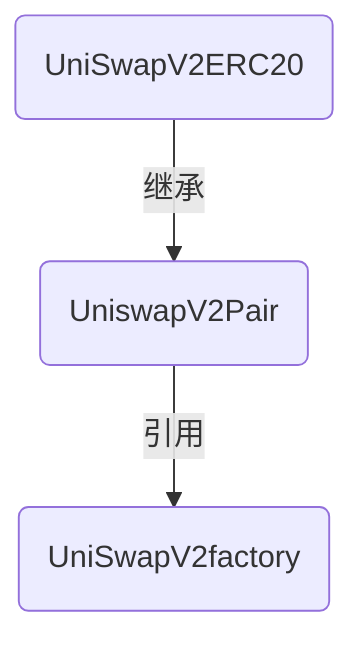
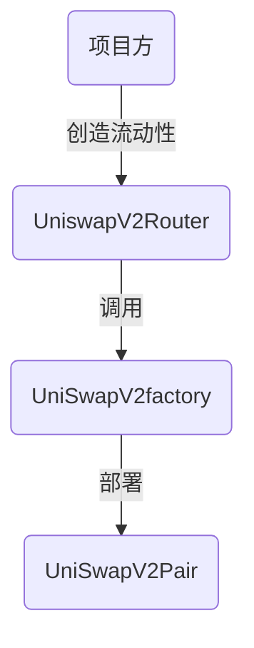
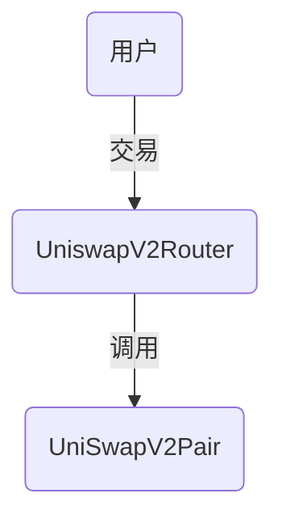

[toc]

## Uniswap 

- URL :https://uniswap.org/

## github 代码

### [核心合约](Uniswap/v2-core)

> 采用waffle测试框架

- 

- UniswapV2ERC20.sol

- UniswapV2Factory.sol
  - 工厂合约部署Pair
- UniswapV2Pair.sol
  - Pair合约继承ERC20
- interfaces 
  - 接口合约，需要继承接口合约

- [library](Uniswap/v2-core/contracts/libraries) 
  - 有一些工具，安全数学工具，solidity 不支持小数

### 周边合约

- 

- contracts 
  - UniswapV2Migrator.sol
  
  - UniswapV2Router01.sol
    
  - UniswapV2Router02.sol
  - example 
    - ExampleFlashSwap.sol 支持闪电交易，支持闪电借贷
    - ExampleOracleSimple.sol 价格预言机 区块头 区块尾 预测哪个方向发展

### v2-sdk

引用到自己的应用中，开发应用

### uniswap-lib 

### https://cn.etherscan.com/

- 路由合约 :https://cn.etherscan.com/address/0x7a250d5630b4cf539739df2c5dacb4c659f2488d#code

- Transactions to一定是合约地址
- internal txs 内部交易

- UML: https://cn.etherscan.com/viewsvg?t=1&a=0x7a250d5630b4cf539739df2c5dacb4c659f2488d

- 工厂合约:https://cn.etherscan.com/address/0x5c69bee701ef814a2b6a3edd4b1652cb9cc5aa6f

## 代码结构
### 合约结构

### 创造流动性

### 交易 

### uniswap的运行逻辑

1.uniswap核心合约分为3个合约，工厂合约，配对合约，ERC20 约
2.核心合约布署时只需要布署工厂合约
3.工厂合约布署时构造函数只需要设定一个手续费管理员
4.在工厂合约布署之后，就可以进行创建配对的操作
5.要在交易所中进行交易，操作顺序是：创建交易对，添加流动性，交易
6.添加配对时需要提供两个token的地址，随后工厂合约会为这个交易对布署一个新的配对合约
7.配对合约的布署是通过create2的方法
8.两个token地址按2进制大小排序后一起进行hash,以这个hash值作为create2的salt进行布署
> 大小顺序排序

9.所以配对合约的地址是可以通过两个token地址进行create2计算的

10.用户可以将两个token存入到配对合约中，然后在配对合约中为用户生成一种兼容ERC20的token

> 流动性Token,继承了ERC20

11.配对合约中生成的erc20Token可以成为流动性
12.用户可以将自己的流动性余额兑换成配对合约中的任何一种token
13.用户也可以取出流动性，配对合约将销毁流动性，并将两种token同时返还用户
14.返还的数量将根据流动性数量和两种token的储备量重新计算，如果有手续费收益，用户也将得到收益
15.用户可以通过一种token交换另一种token，配对合约将扣除千分之3的手续费
16.在uniswap核心合约基础上，还有一个路由合约用来更好的操作核心合约
17.路由合约拥有3部分操作方法，添加流动性，移除流动性，交换

18.虽然配对合约已经可以完成所有的交易操作，但路由合约将所有操作整合，配合前端更好的完成交易
19因为路由合约的代码量较多，布署时会超过qas限制，所以路由合约被分为两个版本，功能互相补充

