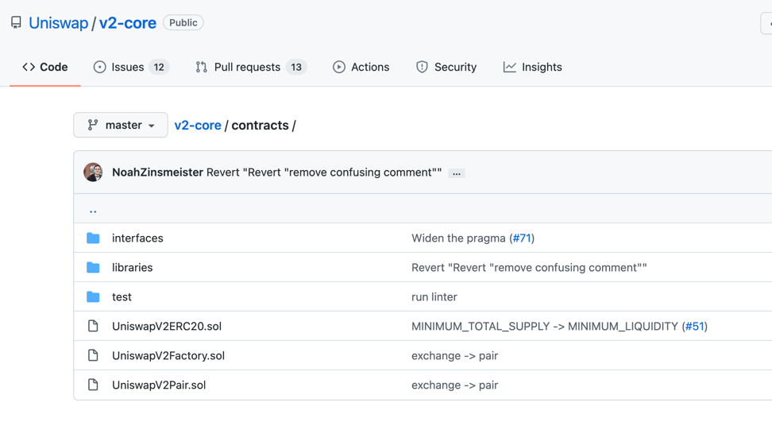

[toc]

## Uniswap 

- URL :https://uniswap.org/

## github 代码

### [核心合约](Uniswap/v2-core)

> 采用waffle测试框架

- 

- UniswapV2ERC20.sol

- UniswapV2Factory.sol
  - 工厂合约部署Pair
- UniswapV2Pair.sol
  - Pair合约继承ERC20
- interfaces 
  - 接口合约，需要继承接口合约

- [library](Uniswap/v2-core/contracts/libraries) 
  - 有一些工具，安全数学工具，solidity 不支持小数

### 周边合约


- 

- contracts 
  - UniswapV2Migrator.sol
  
  - UniswapV2Router01.sol
    
  - UniswapV2Router02.sol
  - example 
    - ExampleFlashSwap.sol 支持闪电交易，支持闪电借贷
    - ExampleOracleSimple.sol 价格预言机 区块头 区块尾 预测哪个方向发展

### v2-sdk

引用到自己的应用中，开发应用

### uniswap-lib 


### https://cn.etherscan.com/

- 路由合约 :https://cn.etherscan.com/address/0x7a250d5630b4cf539739df2c5dacb4c659f2488d#code

- Transactions to一定是合约地址
- internal txs 内部交易

- UML: https://cn.etherscan.com/viewsvg?t=1&a=0x7a250d5630b4cf539739df2c5dacb4c659f2488d

- 工厂合约:https://cn.etherscan.com/address/0x5c69bee701ef814a2b6a3edd4b1652cb9cc5aa6f

## 代码结构

> Uniswap在Github上面开源了全部合约代码，其中包括核心合约，周边合约两部分.Uniswap还开源了前端代码，前端代码使用React开发

- 核心合约
- 周边合约
- 前端代码

> 在UnisWap的核心代码中，主要包含3个合约：工厂合约，配对合约，ERC20合约.其中配对合约继承了ERC20合约，我们可以把它们看作一个合约.工厂合约通过create2方法部署配对合约，所以在部署合约时只需要部署工厂合约，

> 周边合约中包括一些示例代码，例如价格预言机，闪电交换，其中最重要的是路由合约.在周边合约的代码库中，包含两个路由合约：Unsiwapv2Routero1，Unsiwapv2Routero2.工厂合约和配对合约需要通过路由合约调用才能更好的完成交易所的全部功能，所以我们还要部署路由合约


> 两个合约大部分相同，有小部分不同，如果将两个合约的差异化合并成一个合约，部署的时候将会出现out of gas，所以才被分成了两个合约用功两个合约中部包括所以我们部署其中任意一个路由合约都可以


### 合约结构


### 创造流动性


### 交易 


### git操作


- 当一个项目引入git仓库代码时候,git操作 
```
rm -rf .git
git rm --cached . -rf
```

### 白皮书
#### 协议费用

###2.4协议费用
Uniswap v2包含0.05%的协议费用，可以将其打开和关闭。如果启用，
用将发送到工厂合约中指定的FeeTo地址。
最初，未设置feeTo，并且不收取任何费用。预先指定的地址feeToSette
以调用Uniswap v2工厂合约上的setFeeTo函数，将feeTo设置为其他值。
feeToSetter也可以调用setFeeToSetter来更改feeToSetter地址本身
如果设置了feeTo地址，则协议将开始收取5个基本点的费用，这是流动性提
商赚取的30个基本点的费用的$\frac{1}{6}$。也就是说，交易者将继续为
有交易支付0.30%的费用；该费用的83.3%（交易量的0.25%）将流向流
提供者，而该费用的16.6%（交易量的0.05%）将流向该费用收件人。
在交易时收取这0.05%的费用会给每笔交易带来额外的gas成本。为避免这种
况，仅在存入或提取流动性时才收取累积费用。合约计算累计费用，并在铸造
销毁任何代币之前立即向受益者铸造新的流动性代币。
可以通过测量自上次收取费用以来的$\sqrt k$（即$\sqrt{x·y}$)的增
来计算总费用（6）。公式为你提供了$t_1$和$t_2$之间累积的费用，以占其
动性的百分比表示。$t_2$的池：

$$f_{1,2} = 1-\frac{\sqrt {k_1}}{\sqrt {k_2}}$$

如果费用是在$t_1$之前激活的，则feeTo地址应捕获在$t_1$和$t_2$之间累
积的费用中的$\frac{1}{6}$。因此，我们想向新的流动性代币铸造到FeeTo
地址,以表示池的$\phi·f_{1,2}$,其中$\phi$为$\frac{1}{6}$。
也就是说,我们要选择满足以下关系的$s_m$,其中$s_1$是时间$t_1$的流
股总数：

$$\frac{s_m}{s_m+s_1}=\phi·f_{1,2}$$

 

#### 3.2.2 sync()和skim()
[源码](Uniswap/v2-core/contracts/UniswapV2Pair.sol)

为了防止可能更新配对合约余额的定制令牌实现并更优雅地处理总供应量大于
$2^{112}$的令牌，Uniswap v2具有两个纾困功能：sync（）和skim（）
如果令牌异步缩小一对货币对的余额，sync（）充当恢复机制。在这种情况下，
交易将获得次优利率，并且如果没有流动性提供者愿意纠正这种情况，则该交易
对将被卡住。sync（）存在，可以将合约的储备金设置为当前余额，从而可以从
这种情况下略微恢复。
如果将足够的令牌发送到货币对以使两个uint112存储槽中的储备金溢出，
skim（）将用作恢复机制，否则可能导致交易失败.skim（）允许用户提取货币对
当前余额与货币对之间的差额，如果呼叫者的差值大于0，则为$2~{112}-1$。

[WETH合约](Uniswap/v2-periphery/contracts/examples/WETH9.sol)
https://cn.etherscan.com/address/0xc02aaa39b223fe8d0a0e5c4f27ead9083c756cc2

### uniswap的运行逻辑

- 1.uniswap核心合约分为3个合约，工厂合约，配对合约，ERC20 约

- 2.核心合约布署时只需要布署工厂合约

- 3.工厂合约布署时构造函数只需要设定一个手续费管理员

- 4.在工厂合约布署之后，就可以进行创建配对的操作

- 5.要在交易所中进行交易，操作顺序是：创建交易对，添加流动性，交易

- 6.添加配对时需要提供两个token的地址，随后工厂合约会为这个交易对布署一个新的配对合约
- 7.配对合约的布署是通过create2的方法
- 8.两个token地址按2进制大小排序后一起进行hash,以这个hash值作为create2的salt进行布署
> 大小顺序排序

- 9.所以配对合约的地址是可以通过两个token地址进行create2计算的

- 10.用户可以将两个token存入到配对合约中，然后在配对合约中为用户生成一种兼容ERC20的token

> 流动性Token,继承了ERC20

- 11.配对合约中生成的erc20Token可以成为流动性
- 12.用户可以将自己的流动性余额兑换成配对合约中的任何一种token
- 13.用户也可以取出流动性，配对合约将销毁流动性，并将两种token同时返还用户
- 14.返还的数量将根据流动性数量和两种token的储备量重新计算，如果有手续费收益，用户也将得到收益
- 15.用户可以通过一种token交换另一种token，配对合约将扣除千分之3的手续费
- 16.在uniswap核心合约基础上，还有一个路由合约用来更好的操作核心合约
- 17.路由合约拥有3部分操作方法，添加流动性，移除流动性，交换
- 18.虽然配对合约已经可以完成所有的交易操作，但路由合约将所有操作整合，配合前端更好的完成交易
- 19因为路由合约的代码量较多，布署时会超过qas限制，所以路由合约被分为两个版本，功能互相补充

### 特殊方法

- SELECTOR

声明
```
   // selector 常量值为 'transfer(address,uint256)' 字符串哈希值的前4位16进制数字
    // trsanction  input Data --> methodID 8个字符  [0][1] 是参数
    bytes4 private constant SELECTOR = bytes4(keccak256(bytes('transfer(address,uint256)')));**
```


调用
```
   (bool success, bytes memory data) = token.call(abi.encodeWithSelector(SELECTOR, to, value));
        // 确认返回值为true 并且返回的data长度为0或者解码后为true
        require(success && (data.length == 0 || abi.decode(data, (bool))), 'UniswapV2: TRANSFER_FAILED');
```


## 部署合约

 
### 准备部署账户

Unlswap的路由合约部暑在以太坊的主网和Ropten,Rinkeby.Goerl,Kovan几个测试网的合约地址都是相同的，这样可以使Uniswap的前端不管切换到任何一个网络，路由地址都
不会变.要想实现这个相同地址的部署，我们需要准备一个全新的账户用来部署合约.全新的账户指的是在部署合约之前的nonce值为0.因为合约的地址是根据你的账户地址和
nonce值计算出来的，所以在不同网络中，如果nonce值相同，部署出的合约地址也相同
### 通过助记词生成新账户


> 生成好助记词之后，记得用英文助记词，保存好助记词，还有助记词对应的账户地址

### 向新地址转帐ETH
部暑合约需要的gas费约为0.18个Ether

### 准备WETH的合约地址

在部署路由合约时，构造函数中需要填入工厂合约的地址和WETH合约的地址，由于WETH合约的地址在主网和测试网的地址都不相同，所以需要找到每个网络中WETH合约的地
址.
WETH合约用于将Eth交换为erc20的Eth,由于Eth不是erc20的token，所以我们必须使用WETH作为交换媒介
```
{
mainnet:'8xC82aaA39b223FE8D8ABe5C4F27eAD9083C756Cc2',
ropsten:'0xc778417E063141139Fce010982780140Aa0cD5Ab',
rinkeby:'0xDf032Bc4B9dC2782Bb09352007D4C57B75160B15',
goerli:'0xB4FBF271143F4FBf7B91A5ded31805e42b2208d6',
kovan:'8xdeA1E359811322d97991E83f863a0C30C2cF029C'
}
```

### 申请infuraKey

在部暑合约之前，我们还需要使用infura作为免费节点，所以需要申请一个infuraKey


### 工厂合约部署在remix

>合约地址 https://cn.etherscan.com/address/0xc02aaa39b223fe8d0a0e5c4f27ead9083c756cc2#code
> 复制源码到remix,进行编译

> 注意下面配置


### 路由合约

> 合约地址 :https://cn.etherscan.com/address/0x7a250d5630b4cf539739df2c5dacb4c659f2488d#code


> 复制源码到remix,进行编译

### 部署顺序和构造函数
- 1.部署工厂合约
  - 构造函数的参数是一个自己常用的账户地址
- 2.部署路由合约01[可选]，02
  - 构造函数的参数1是工厂合约的地址
  - 参数2是当前网络中WETH合约的地址，参考前文

### 部署Uniswap前端
- 克隆前端代码
在项目目录运行命令：
```
$ git clone https://github.com/Uniswap/uniswap-interface.git

```

- 安装依赖库
在项目目录运行命令,安装依赖：
```
$ cd uniswap-interface

yarn 
```
> 安装完成后，可以先测试运行一下，在uniswap-interface目录运行命令

```
yarn start
```

如果运行成功,就会打开uniswap前端网页

#### 修改路由地址

> 在Uniswap的前端中以常量的形式定义了Uniswap的路由地址，我们只需要修改路由地址就可以让前端链接到你的路由合约中

```
rinkby
//0x2A2b995f6f5432bCe22425e84dF86918c4ead37b
ropsten
//0x468a7548920835a7765591cdA249BC202d685ebf

```


> 修改文件：项目目录/uniswap-interface/src/constants/index.ts第6行
```
import { AbstractConnector } from '@web3-react/abstract-connector'
import{ ChainId,JSBI,Percent,Token,WETH } from'@uniswap/sdk'
import { fortmatic, injected, portis, walletconnect, walletlink } from'../connectors'
export const ROUTER_ADDRESS ='0x7a250d5630B4cF539739dF2C5dAcb4c659F2488D'//修改成你的路由合约地址

```


保存后运行 yarn start即可看到效果

### 将代码部署到GitHub Pages
#### 创建GitHub项目

 
 
将前端代码添加到GitHub项目仓库
首先要删除原先Uniswap项目中的.git目录，在项目目录运行命令：
```
$ cd uniswap-interface
$ rm rf .git
```
然后初始化git，井将Unsiwap前端代码添加到自己的项目仓库中

```
git init
git remote add origin https://github.com/用户名/项目名.git
```


#### 安装并部署gh-pages

我们将通过gh-pages模块将前端代码部署到github.lo,在前端代码的目录运行：
```
$ yarn add gh-pages
```

接下来要编译react和部看gh-pages,在前端代码的目录运行：
```
$ yarn build
```

修改前端代码目录中的package.json
```
$ vim package.json
"name":
"@uniswap/interface",
"description": "Uniswap Interface",
"homepage"："https://用户名.github,io/项目名称"，//修改这里
// 添加部著的脚本，还是在package.json中
"scripts":{
"deploy"："gh-pages -d build"//添加这一行
}

```

保存退出之后，在前端代码的目录运行：

```
$ git add .
$ git commit -m "first commit"
$ git push
// 编译
$ yarn build 
// 部署
$ yarn deploy
```


现在在浏览器中打开https://用户名.github.io/项目名称/index.html就可以
https://darrenli6.github.io/LijiaSwap
打开自己的交易所啦。
如果不输入地址结尾的index.html在项目刚部署之后会报错，过一段时间就可以
不输入了


```
$ gh-pages -d build
fatal: A branch named 'gh-pages' already exists.

error Command failed with exit code 1.

rm -rf node_modules/.cache/gh-pages 

```